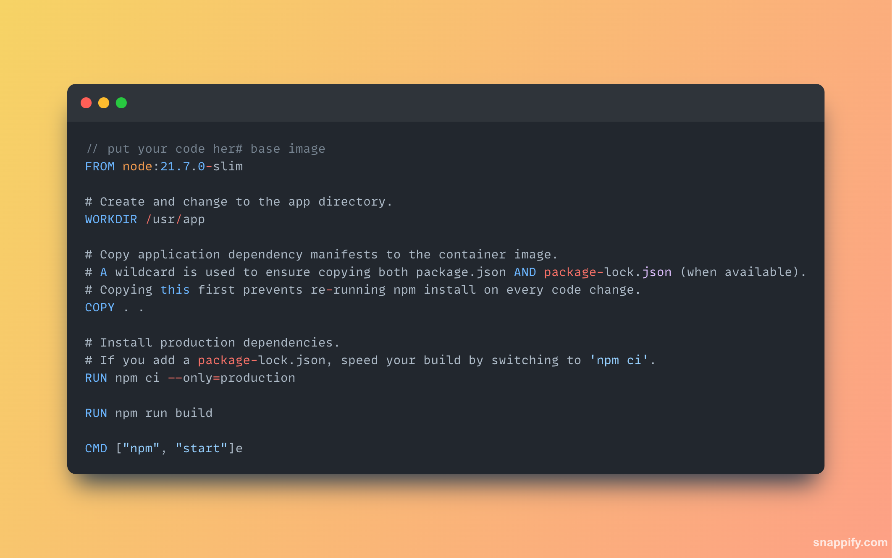
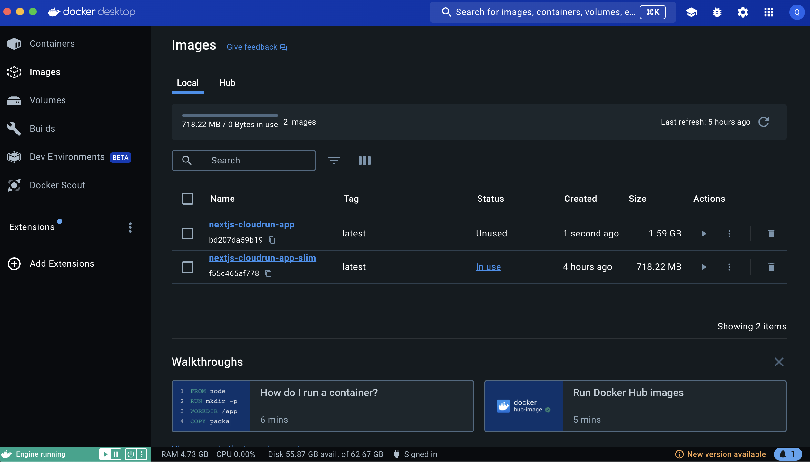
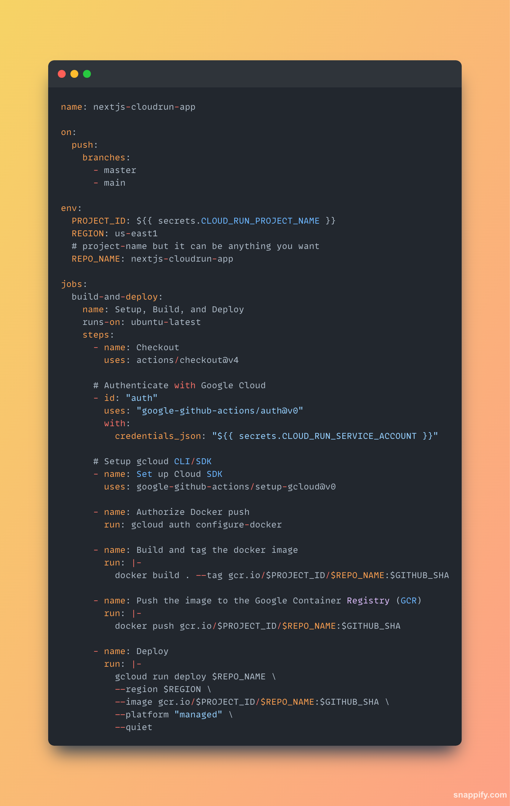
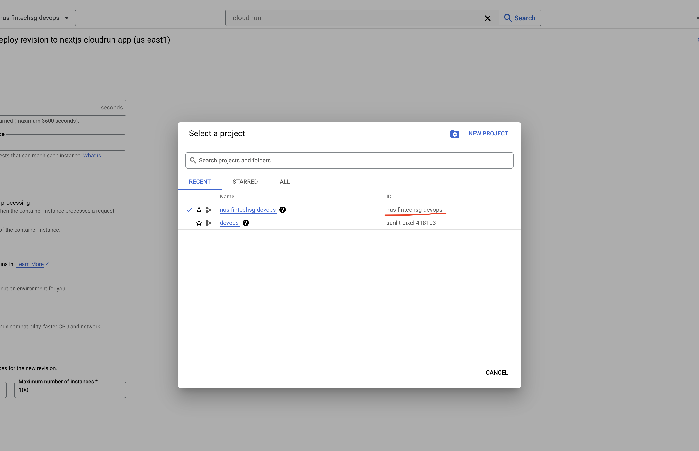
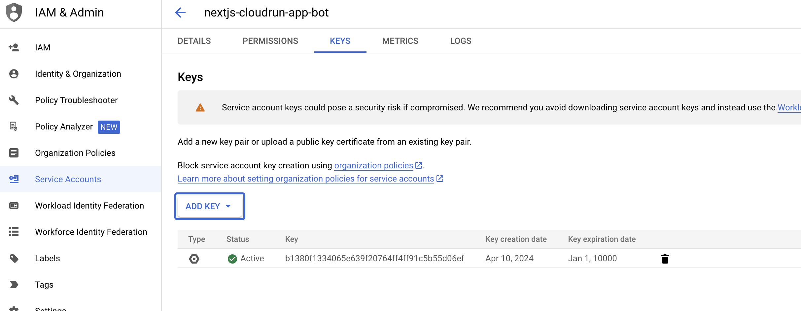
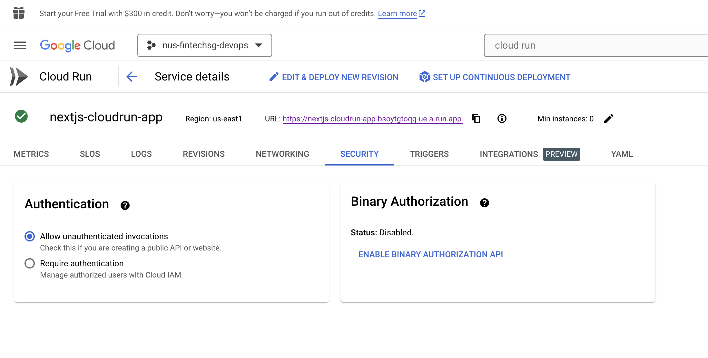

# Introduction

## What is this repository about ?

This repository serves as an assignment submission for the NUS Fintech program's DevOps course. It is designed to provide hands-on experience with the essential tools and processes of DevOps, utilizing GitHub Actions, Docker, and deployment onto the Google Cloud platform.

## What I'm trying to achieve ?

Through this project, my goal is to gain practical experience with the essential tools and processes of DevOps. Specifically, I aim to familiarize myself with GitHub Actions for automating workflows, Docker for containerization, and deploying applications onto the Google Cloud platform. By completing this assignment, I aim to develop a solid understanding of how these technologies integrate to streamline software development and deployment processes, preparing me for future endeavors in projects where DevOps practices are essential for success.

# Deploy Dockerized Next JS App to Google Cloud Run with Github Actions CI/CD

### Create a Next JS App

`npx create-next-app --use-npm`

### Dockerize the Next App

1. Create a Dockerfile which contains instructions to build a Docker images.
   
   Explanation of Configuration::

   <u>Base Image:</u>

   Uses the current project node version v21.7.0 (`node -v`) and uses the slim as the lightweight base image.

   Let's find out the difference between a normal base image vs a lightweight base image.

   First run `docker build . -t nextjs-cloudrun-app:latest`

   and then run `docker build . -t nextjs-cloudrun-app-slim:latest`

   

   As seen from the screenshot above, the sizes of a normal docker size image is almost 2 times of a lightweight slim base image.

   <u>Dependency Installation:</u>

   Copy application dependency manifests to the container image.A wildcard is used to ensure copying both package.json AND package-lock.json (when available).
   Copying this first prevents re-running npm install on every code change.

### Setting Up Google Cloud Services

- Creating a project on google cloud
- Creating a service account with roles

  1. Editor
  2. Cloud Run Admin
  3. Storage Admin
  4. Service Account User

- Enabling Google Cloud APIs
  1. Google Cloud Run
  2. Google Container Registry

### Creating CI/CD in Github workflow (Action)

In the context of GitHub Actions, CI/CD refers to the automated processes facilitated by GitHub's workflow system. GitHub Actions empowers users to create customizable workflows, defined through YAML files, to automate various tasks within their repositories, including CI/CD operations. These workflows are triggered by specific events such as code pushes, pull requests, or other repository activities, enabling seamless integration and deployment processes tailored to the project's requirements.

 

Now Let's create the github workflows yaml code.

First, create a folder name `.github` at the the project root and `workflows` folder inside it.

then create a file named `cloud-run.yml` with the code show below

In order for the above code to work, there are some secrets that we need to set up first

### Setting up secrets in GitHub

We will need to create the following secret key under Github Action Secrets

1. CLOUD_RUN_PROJECT_NAME

2. CLOUD_RUN_SERVICE_ACCOUNT

- We will need to generate a key in JSON format for this secret value.
  For security purpose, we will convert the JSON file into base64 format with `base64 -i <INPUT FILE_NAME HERE>`

### Commit and push code to Git

Last but not least, all the code will be deploying to git

1. `git add .`
2. `git commit -m 'initial commit'`
3. `git push`

If everything works perfectly, GitHub action will be triggered.

### Accessing the application through url

Finally the last step is to access our application through url. However, before we do this, we will need to allow unauthentication invocation under Google Cloud Run -> Security

**_PLEASE NOTE THAT THIS IS NOT A GOOD PRACTICE_**

Next we can access the web page using the url below.

https://nextjs-cloudrun-app-bsoytgtoqq-ue.a.run.app/

Summary:

After learning DevOps, I've gained a comprehensive understanding of how to optimize software development and deployment processes through collaboration, automation, and continuous improvement. I've learned to integrate development and operations seamlessly, employing tools and practices such as continuous integration, continuous delivery/deployment, and infrastructure as code. This holistic approach has equipped me with the skills to streamline workflows, enhance team collaboration, and deliver high-quality software more efficiently. With a focus on automation and monitoring, I'm empowered to drive continuous innovation, ensuring that software is delivered reliably and at scale. Overall, my journey in learning DevOps has provided me with the tools and mindset necessary to succeed in today's dynamic and fast-paced software development landscape.
